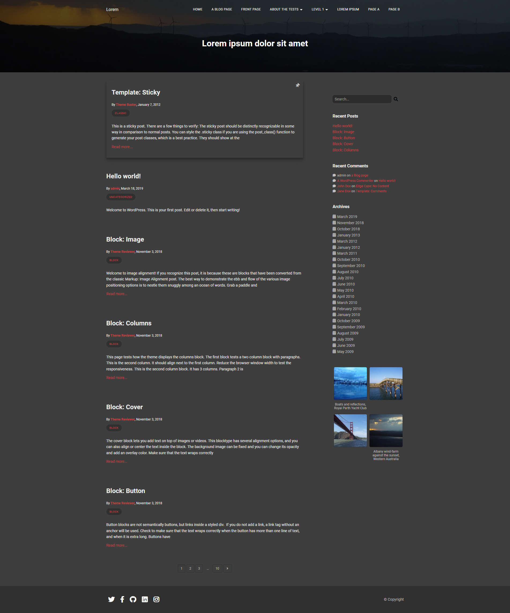

# Darko



## Theme Installation:
This command will generate a clean .zip archive of the theme. Archive will be located at `bundled/darko.zip`. 
```
npm run build
```
Place the archive inside a new directory named `darko` then extract it. Place the theme directory under your Wordpress installation themes directory and then select it from admin panel Appearance -> Themes.